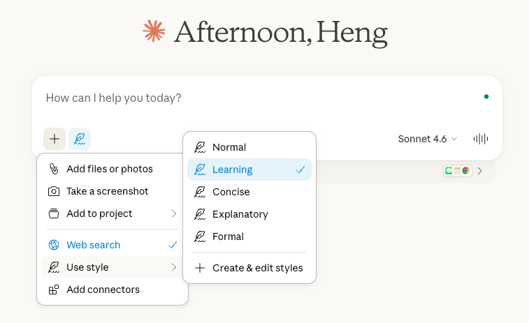

# Assignment 2: Learning AI with AI

## Objective

This assignment asks you to use a large language model as your primary learning tool for a complex concept.

The purpose is not only to understand the concept. The purpose is to examine what happens when you rely on AI to learn something that feels beyond your background knowledge.

You are encouraged to challenge yourself. Choose something that you would normally avoid because it seems too technical, abstract, or outside your expertise.

## Step 1: Choose One Concept

Select one concept that you consider difficult or outside your expertise.

You may choose:

### Option A: AI-related concepts

Examples include:

* Monte Carlo methods
* Markov decision processes
* Attention mechanisms
* Bayesian inference in machine learning
* Generative adversarial networks

### Option B: A concept from another discipline

You may also choose a concept from another field such as:

* Chemistry
* Medicine
* Economics
* Physics
* Law
* Engineering

The key requirement is this: You believe that, without AI assistance, you would not be able to easily develop a deeper understanding of this concept. Avoid choosing something you already understand well.

## Step 2: Learn Using an LLM

Use one large language model, such as:

* [ChatGPT](https://chatgpt.com/?hints=study) ([Introduction to ChatGPT's study mode](https://chatgpt.com/features/study-mode/))
* [Google Gemini](https://gemini.google.com/guided-learning) ([introduction to Guided Learning in Gemini](https://blog.google/products-and-platforms/products/education/guided-learning/))
* [Claude](https://claude.ai/) (Click the "+" icon, select "Use style," and choose "Learning" before starting your conversation.)
<div class="figure-row">
<figure class="course-figure">
    
    <figcaption>
    <em>Claude learning style</em>
    </figcaption>
</figure>
</div>

Spend meaningful time interacting with the model. Your conversation must show sustained engagement. A short exchange of one or two questions is not sufficient.

Your interaction may include elements such as:

1. An initial explanation request
2. At least two follow-up clarification questions
3. A request for a more technical or advanced explanation
4. A request to compare the concept with a related idea
5. A request for a concrete example or real-world application

You may also ask the model to:

* Explain step by step
* Provide an analogy
* Simplify and then re-explain at a deeper level
* Identify common misconceptions
* Test your understanding

A typical strong submission will include multiple rounds of questioning and follow-up. Extremely short interactions are unlikely to receive full credit. The goal is depth of exploration, not a single explanation.

## Step 3: Submit Your Files

You will submit **one ZIP file** that contains the following two files:

1. A Word document (.docx) containing Concept Selection and Reflection
2. A plain text file (.txt) containing the full AI interaction log

Name your ZIP file: `Lastname_Firstname_Assignment2.zip` Upload the ZIP file to Canvas.

### A. Concept Selection and Reflection (Word document)

Submit one Word document that includes the following two sections:

**1. Concept Selection (2 to 3 sentences)**

* What concept did you choose
* Why does it feel beyond your background

**2. Reflection (100 to 150 words)**

Address the following:

* Did the AI explanation help you understand the concept?
* At what point did you feel more confident or less confident?
* Did you notice oversimplification or overcomplexity?
* How do you know whether the explanation is accurate?
* Would you rely on AI alone to learn advanced topics in the future?

Be specific. Avoid vague statements.

Save the file as: `Lastname_Firstname_Assignment2.docx`

### B. AI Interaction Log (Plain Text File)

Submit your full AI conversation as a separate plain text file.

Before preparing your .txt file, refer to [Preparing Your AI Interaction Log](../assignments/log-demo.qmd) for detailed instructions on how to correctly copy, format, and submit your complete interaction history.

Requirements:

* Save the file as a **.txt** document
* Copy and paste the entire conversation as it appears in the interface into the file
* Do not summarize
* Do not shorten
* Do not reorganize
* Do not edit or rewrite the content
* Do not remove any prompts or responses
* The only edits allowed are the removal of obvious interface elements or personal or sensitive information
* Do not submit public share links

Save the file as: `Lastname_Firstname_Assignment2_Log.txt` 

Your .txt file should look like this:

```
Concept: [Insert your selected concept]
Model used: [Insert model name]

--- Conversation Start ---

User:
[Paste your first prompt exactly as written]

AI:
[Paste the model’s response exactly as shown]

User:
[Paste your next prompt]

AI:
[Paste the model’s response]

...

--- Conversation End ---
```

Do not rewrite or improve the responses. Copy them exactly as shown in the interface.

---

## Grading (15 points total)

Grading will be holistic and based on three criteria:

* 9 points: Clear evidence of serious engagement with the model. The conversation shows depth, follow-up questioning, and exploration beyond a short exchange.
* 3 points: Complete submission format. The document follows all required sections and formatting instructions, including concept selection, full unedited conversation log submitted as a separate .txt file, and proper organization of both required files.
* 3 points: Specific reflection. The reflection addresses the prompts directly and demonstrates critical thinking rather than general statements.

Submissions with minimal interaction or incomplete logs will not receive full credit.