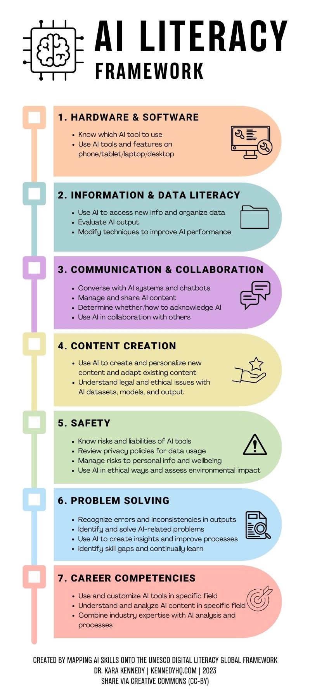

# Introduction to AI and Its Role in Information Professions

## What Is Artificial Intelligence?

Defining artificial intelligence (AI) is not straightforward. AI is a rapidly evolving field, and definitions that were common in the 1990s may no longer fully apply in the 21st century. As noted in one of the most authoritative textbooks in the field, *Artificial Intelligence: A Modern Approach* by Peter Norvig and Stuart J. Russell, AI systems were previously understood as optimizing a predefined utility function supplied by their human designers. In more recent formulations, this assumption is relaxed: an AI system does not necessarily know the exact objectives it is meant to pursue. Instead, it may be uncertain about human goals and must learn what to optimize, while still behaving in an appropriate and responsible manner despite this uncertainty.

I view AI as the practice of endowing machines with intelligence. However, what counts as “intelligence” itself remains a subject of ongoing debate in academia and is often intertwined with philosophical discussions. This lack of consensus helps explain why some researchers predict that artificial general intelligence (AGI) may arrive within a few years, while others argue that AGI is still a distant prospect.

Early definitions of AI can be traced back to the 1950s. In his paper “[Computing Machinery and Intelligence](https://doi.org/10.1093/mind/LIX.236.433),” Alan Turing proposed the question, “Can machines think?” Turing also introduced what later became known as the Turing Test, originally called the *imitation game*. Under this framework, a machine can be said to exhibit intelligence if its conversational behavior is indistinguishable from that of a human, as judged by a human interrogator under controlled conditions. A 2025 study has claimed that [large language models have passed the Turing Test](https://doi.org/10.48550/arXiv.2503.23674), but this claim has also been [challenged](https://doi.org/10.1038/d41586-025-03386-w). These debates raise a fundamental question: does imitation alone constitute intelligence? If a machine can imitate human behavior, does that mean it truly understands humans?

Other influential definitions of AI include that of John McCarthy, one of the pioneers of the field, who answered the question “[What is AI?](http://jmc.stanford.edu/artificial-intelligence/what-is-ai/index.html)” by stating: “It is the science and engineering of making intelligent machines, especially intelligent computer programs. It is related to the similar task of using computers to understand human intelligence, but AI does not have to confine itself to methods that are biologically observable.”

Another widely cited definition comes from *Artificial Intelligence: A Modern Approach*, which defines AI as “the study of agents that receive percepts from the environment and perform actions.”

In public discourse, AI is often conflated with machine learning (ML). From the perspective of many AI researchers, however, ML is not equivalent to AI; rather, it is a subfield within AI. By the same logic, neural networks, deep learning, and even large language models are all sub-concepts within the broader domain of AI.

Also see the following talk from Mustafa Suleyman, current Microsoft AI CEO, for his opinions on what AI is:
<div style="position:relative;padding-bottom:56.25%;height:0;overflow:hidden;">
  <iframe
    src="https://www.youtube-nocookie.com/embed/KKNCiRWd_j0"
    title="What Is an AI Anyway?"
    style="position:absolute;top:0;left:0;width:100%;height:100%;border:0;"
    allow="accelerometer; autoplay; clipboard-write; encrypted-media; gyroscope; picture-in-picture; web-share"
    allowfullscreen>
  </iframe>
</div>

## AI Literacy

AI literacy can be interpreted through the framework developed by Dr. Kara Kennedy.

<div class="figure-row">

  <figure class="course-figure">
  

  <figcaption>
    <em>AI Literacy Framework (Kennedy, 2023)</em>
  </figcaption>

  <details class="image-source">
    <summary>Image source</summary>
    <div class="image-source-body">Image: Kara Kennedy (2023), <em>AI Literacy Framework</em><br>
License: CC BY 4.0<br>
<a href="https://kennedyhq.com/wp/2023/12/21/ai-literacy-framework/" target="_blank" rel="noopener">kennedyhq.com</a></div>
  </details>
</figure>

</div>


## Key References and Organizations in Artificial Intelligence

**Artificial Intelligence: A Modern Approach**
*Stuart Russell* & *Peter Norvig*

Often regarded as the most influential textbook in artificial intelligence, AIMA provides a comprehensive overview of core AI concepts, paradigms, and methods. It is the authoritative, most-used AI textbook, adopted by over 1500 schools.

**Major AI Organizations and Research Communities**

- [Association for the Advancement of Artificial Intelligence (AAAI)](https://aaai.org/)
A premier scientific society in AI. AAAI organizes the annual AAAI Conference on Artificial Intelligence.

- [International Joint Conference on Artificial Intelligence (IJCAI)](https://www.ijcai.org/)
A non-profit organization (founded in 1969) that runs IJCAI conferences. IJCAI conferences are premier international gatherings of AI researchers and practitioners.

- [Association for Computing Machinery (ACM)](https://www.acm.org/)
The world’s largest educational and scientific computing society. ACM provides the ACM Digital Library and supports publications and conferences.

- [Institute of Electrical and Electronics Engineers (IEEE)](https://www.ieee.org/)
The world’s largest technical professional organization, advancing technology for the benefit of humanity through publications, conferences, and standards.

## A Brief History of AI

Over time, AI has evolved from symbolic approaches to data-driven learning and, most recently, to generative models, reflecting both changing views of intelligence and advances in computing technology.

### 1940s–1950: Foundations

**1936**  
Alan Turing publishes *[On Computable Numbers](https://doi.org/10.1112/plms/s2-42.1.230)*, introducing **Turing machine** as a formal computation model.

**1950**  
Alan Turing publishes *[Computing Machinery and Intelligence](https://doi.org/10.1093/mind/LIX.236.433)*.  
Introduces the **Imitation Game (Turing Test)** as an evaluation criterion for machine intelligence.

<div class="figure-row size-sm">

  <figure class="course-figure">
    
    <figcaption><em>Alan Turing</em></figcaption>

    <details class="image-source">
      <summary>Image source</summary>
      <div class="image-source-body">Image: Wikimedia Commons (Public Domain)<br>
https://commons.wikimedia.org/wiki/File:Alan_turing_header.jpg</div>
    </details>
  </figure>
</div>

### 1956: Birth of AI as a Field

**1956**  
The **[Dartmouth Summer Research Project on Artificial Intelligence](http://jmc.stanford.edu/articles/dartmouth/dartmouth.pdf)** is held.

Key figures include:  

- John McCarthy  
- Marvin Minsky  
- Claude Shannon   

Significance:  

- First mention of **Artificial Intelligence**  
- Established AI as a distinct field

<div class="figure-row size-sm">

  <figure class="course-figure">
    
    <figcaption><em>John McCarthy</em></figcaption>

    <details class="image-source">
      <summary>Image source</summary>
      <div class="image-source-body">Image: Wikimedia Commons (CC BY-SA 2.0)<br>
https://commons.wikimedia.org/wiki/File:John_McCarthy_Stanford.jpg</div>
    </details>
  </figure>

  <figure class="course-figure">
    
    <figcaption><em>Marvin Minsky</em></figcaption>

    <details class="image-source">
      <summary>Image source</summary>
      <div class="image-source-body">Image: Wikimedia Commons (CC BY-SA 4.0)<br>
https://commons.wikimedia.org/wiki/File:Marvin_Minsky_at_OLPCb_(3x4_cropped).jpg</div>
    </details>
  </figure>

  <figure class="course-figure">
    
    <figcaption><em>Claude E. Shannon</em></figcaption>

    <details class="image-source">
      <summary>Image source</summary>
      <div class="image-source-body">Image: Wikimedia Commons (CC BY 2.0)<br>
https://commons.wikimedia.org/wiki/File:C.E._Shannon._Tekniska_museet_43069_(cropped).jpg</div>
    </details>
  </figure>

</div>

### 1950s–1990s: Symbolic / Logic-Based AI

Core idea:  
Many early AI researchers believed that AI could be achieved using expert curated knowledge and rules, thereby mimicking human logical reasoning.

Characteristics:  

- Rule-based systems (if–then rules)  
- Formally represent information, knowledge, and rules. 
- Strong links to ontologies, taxonomies, and knowledge organization

Well-known examples:  
- **Early Natural Language Systems (1960s–1970s)**: [ELIZA](https://en.wikipedia.org/wiki/ELIZA) and [SHRDLU](https://en.wikipedia.org/wiki/SHRDLU)  
- **Expert Systems in Industry (1970s–1980s)**: [MYCIN](https://en.wikipedia.org/wiki/Mycin) (a research medical expert system) and [XCON/R1](https://en.wikipedia.org/wiki/Xcon)    
- **[Japan’s Fifth Generation Computer Systems Project](https://en.wikipedia.org/wiki/Fifth_Generation_Computer_Systems) (1982–1992)**: A national initiative focused on logic programming (e.g., Prolog) and symbolic AI, which failed to meet its goals despite substantial investment.  
- **[IBM Deep Blue](https://www.ibm.com/history/deep-blue) (1997)**: A chess system that defeated world champion Garry Kasparov using symbolic AI.  

<div class="figure-row size-sm">

  <figure class="course-figure">
    
    <figcaption><em>IBM Deep Blue</em></figcaption>

    <details class="image-source">
      <summary>Image source</summary>
      <div class="image-source-body">Image: Wikimedia Commons (CC BY 2.0)<br>
https://commons.wikimedia.org/wiki/File:Deep_Blue.jpg</div>
    </details>
  </figure>

</div>


Limitations:  

- Knowledge acquisition bottleneck: required extensive rules and domain knowledge, which were costly to construct and maintain.  
- Difficult to scale beyond small, well-defined domains  
- These limitations led to **[AI winters](https://en.wikipedia.org/wiki/AI_winter)**, when funding cuts and public interest reduced, particularly around 1974–1980 and 1987–2000. 

### 1980s–2010s: Data-Driven AI (Machine Learning and Deep Learning)

Key idea:  
Instead of being programmed step by step, machine learning systems learned by examining many examples (data) and identifying patterns in the data.

Early machine learning (1980s–1990s):

- Handwriting recognition    
- Speech recognition systems  
- Email spam filtering and text classification

Deep learning era (2000s–2010s):  

- Larger neural networks trained on massive datasets  
- Thanks to increased computing power (e.g., GPUs from Nvidia)  
- Breakthroughs in areas such as computer vision, speech recognition, and machine translation.   
- Examples include [AlphaGo](https://en.wikipedia.org/wiki/AlphaGo_versus_Lee_Sedol) (2016) by DeepMind that defeated world champion Lee Sedol in Go, Advanced driver-assistance systems (e.g., [Tesla Autopilot](https://en.wikipedia.org/wiki/Tesla_Autopilot)), and [AlphaFold](https://en.wikipedia.org/wiki/AlphaFold) by DeepMind for protein structure predictions.  

<div class="figure-row size-sm">

  <figure class="course-figure">
    
    <figcaption><em>AlphaGo</em></figcaption>

    <details class="image-source">
      <summary>Image source</summary>
      <div class="image-source-body">Image: Wikimedia Commons (Public Domain)<br>
https://commons.wikimedia.org/wiki/File:Alphago_logo_Reversed.svg</div>
    </details>
  </figure>

  <figure class="course-figure">
    
    <figcaption><em>Lee Sedol</em></figcaption>

    <details class="image-source">
      <summary>Image source</summary>
      <div class="image-source-body">Image: Wikimedia Commons (CC BY 3.0)<br>
https://commons.wikimedia.org/wiki/File:Lee_Se-dol_2012.jpg</div>
    </details>
  </figure>

  <figure class="course-figure">
    
    <figcaption><em>Tesla Autopilot</em></figcaption>

    <details class="image-source">
      <summary>Image source</summary>
      <div class="image-source-body">Image: Wikimedia Commons (CC BY-SA 4.0)<br>
https://en.wikipedia.org/wiki/File:Tesla_Autopilot_engaged_on_I-80_near_Lake_Tahoe.jpg</div>
    </details>
  </figure>
</div>

- Advances in deep learning have been linked to Nobel Prize-winning achievements, including
Geoffrey Hinton’s [2024 Nobel
Prize in Physics](https://www.nobelprize.org/prizes/physics/2024/hinton/facts/) for artificial neural networks and
Demis Hassabis’s [Nobel Prize in Chemistry](https://www.nobelprize.org/prizes/chemistry/2024/hassabis/facts/) for protein structure prediction.

<div class="figure-row size-sm">

  <figure class="course-figure">
    
    <figcaption><em>Demis Hassabis</em></figcaption>

    <details class="image-source">
      <summary>Image source</summary>
      <div class="image-source-body">Image: Wikimedia Commons (CC BY-SA 4.0)<br>
https://commons.wikimedia.org/wiki/File:Demis_Hassabis_in_2025_by_Christopher_Michel_A.jpg</div>
    </details>
  </figure>

  <figure class="course-figure">
    
    <figcaption><em>Geoffrey E. Hinton</em></figcaption>

    <details class="image-source">
      <summary>Image source</summary>
      <div class="image-source-body">Image: Wikimedia Commons (CC BY-SA 4.0)<br>
https://commons.wikimedia.org/wiki/File:Geoffrey_E._Hinton,_2024_Nobel_Prize_Laureate_in_Physics_(cropped1).jpg</div>
    </details>
  </figure>

</div>

Limitations:  

- **Black box**: It was often hard to understand or explain systems' decision-making process, even to its designers. Further information can be found in this [paper](https://doi.org/10.1177/2053951715622512).  
- **Data dependence**: Machine learning systems are only as good as the data they learn from. Biased or low-quality data leads to biased or unreliable results. Here is an [example](https://proceedings.mlr.press/v81/buolamwini18a.html). 

### 2017–Present: Attention is all you need

**2017**

Based on deep learning and neural networks, a team of researchers at Google published a groundbreaking paper in 2017 titled *[Attention Is All You Need](https://proceedings.neurips.cc/paper_files/paper/2017/file/3f5ee243547dee91fbd053c1c4a845aa-Paper.pdf)*. This work introduced the Transformer architecture and is widely recognized as a major milestone that enabled the development of modern generative AI.

However, progress was not instant. When the Transformer architecture was first introduced, it did not immediately receive ongoing strategic focus within Google.

**2022–Present**

Instead, the newly founded company OpenAI was among the first to successfully deploy large language models based on the Transformer architecture at scale. The release of ChatGPT marked the first instance of a large language model achieving widespread public adoption and commercial success.

<div class="figure-row size-sm">

  <figure class="course-figure">
    
    <figcaption><em>ChatGPT on Mobile Phone</em></figcaption>

    <details class="image-source">
      <summary>Image source</summary>
      <div class="image-source-body">Image: Wikimedia Commons (CC BY 2.0)<br>
https://commons.wikimedia.org/wiki/File:Mobile_phone_with_ChatGPT_on_keyboard_(52916924616).jpg</div>
    </details>
  </figure>

</div>


Subsequent examples of large language models include Claude by Anthropic, Gemini by Google, and Grok by xAI. 

Large language models demonstrate a range of language-related capabilities, including:

- Text generation  
- Summarization  
- Translation  
- Question answering  
- Code generation 

Governments have recognized the importance of artificial intelligence development. For example, the United States has recently introduced several initiatives and policies, such as the GENESIS Mission (https://www.whitehouse.gov/presidential-actions/2025/11/launching-the-genesis-mission/).

At the same time, industry has invested heavily in building AI data centers, reflecting ambitious efforts toward achieving artificial general intelligence (AGI).

However, despite their abilities, large language models also have limitations:

- **Hallucinations**: models may produce incorrect information while presenting it with high confidence  
- **Dependence on training data quality**: biased or low-quality data can lead to unreliable outputs  
- **Environmental impact**: training and deploying large models requires substantial electricity and computing resources  
- **Copyright concerns**: the use of copyrighted materials in training data remains contested

## Everyday AI

AI has been integrated into society for decades.
In earlier stages, these systems were rarely labeled as “AI,” but were introduced through their practical functions.

Examples of early AI applications include:

- Rule-based expert systems (e.g., medical decision support)
- Search and information retrieval systems
- Email spam filtering and text classification
- Recommendation systems (books, movies, products)
- Speech and handwriting recognition

In the era of generative AI, AI technologies are everywhere:

- [AI in Google search](https://search.google/ai-in-search/), [ChatGPT search](https://openai.com/index/introducing-chatgpt-search/):
    - AI Overviews provide quick summaries of key information. Summaries include links to external web sources for further exploration
    - Support multimodal interaction with users, enabling them to search with text, voice, images, and visual context.

<div style="position:relative;padding-bottom:56.25%;height:0;overflow:hidden;">
  <iframe
    src="https://www.youtube-nocookie.com/embed/qbqZQFOVfA8"
    title="AI Mode: A New Experiment in Google Search"
    style="position:absolute;top:0;left:0;width:100%;height:100%;border:0;"
    allow="accelerometer; autoplay; clipboard-write; encrypted-media; gyroscope; picture-in-picture; web-share"
    allowfullscreen>
  </iframe>
</div>


- Video platforms such as YouTube use personalized recommendation systems and [generative AI features](https://support.google.com/youtube/answer/14110396?hl=en) that allow users to ask questions about videos.
- Writing assistant tools, such as Grammarly, can help non-native speakers identify and correct grammatical issues.
- [AI-powered chatbots](https://www.ibm.com/think/topics/ai-customer-service-chatbots) for customer support and FAQs. 
- Generative AI models can create videos from text prompts, such as [OpenAI's Sora](https://openai.com/index/video-generation-models-as-world-simulators/). The following example shows a short welcoming video generated using Sora with the prompt below.

<div style="position:relative;padding-bottom:56.25%;height:0;overflow:hidden;">
  <iframe
    src="https://www.youtube-nocookie.com/embed/kFbg19Ic0O0"
    title="Sora 2 generated welcoming video"
    style="position:absolute;top:0;left:0;width:100%;height:100%;border:0;"
    allow="accelerometer; autoplay; clipboard-write; encrypted-media; gyroscope; picture-in-picture; web-share"
    allowfullscreen>
  </iframe>
</div>

Prompt used for video generation ([Sora](https://sora.chatgpt.com/))

``` { .text .copy }
A welcome video set in a university classroom at the University of Kentucky. The Wildcat mascot walks into an AI literacy classroom, faces the students, and speaks clearly and calmly: “Welcome to the AI Literacy for Information Organizations course at the University of Kentucky. We’re excited to have you in this course. Let’s get started.” Professional academic tone, friendly and welcoming.
```

## AI in Information Professions

### AI as Library Practice

AI contributes to core library and information tasks, including:

- Linked data for metadata and knowledge organization:  
    - linked data work by OCLC ([OCLC Linked Data](https://www.oclc.org/en/linked-data.html))
- Search and discovery systems:  
    - Ex Libris Primo with the [Research Assistant feature](https://knowledge.exlibrisgroup.com/Primo/Product_Documentation/020Primo_VE/Primo_VE_(English)/015_Getting_Started_with_Primo_Research_Assistant).  
    - Campus-wide example: University of Kentucky [InfoKat Discovery](https://saalck-uky.primo.exlibrisgroup.com/discovery/search?vid=01SAA_UKY:UKY) with Research Assistant enabled. 

<div class="figure-row">
  <figure class="course-figure">
  
    <figcaption>
      <em>Research Assistant at the University of Kentucky’s InfoKat Discovery</em>
    </figcaption>
  </figure>
</div>

**Other examples and resources**

The following resources provide examples of how AI is being explored and applied in library contexts.

- Institutional guidance and practice:
    - University of Kentucky Libraries [resources on generative AI use](https://libguides.uky.edu/genai/resources)
    - University of North Carolina Libraries [guidance on generative AI and libraries](https://guides.lib.unc.edu/generativeAI/ai-libraries)

- Professional perspectives on AI in public libraries:
    - [Using AI on the job](https://www.webjunction.org/news/webjunction/using-ai-on-the-job.html)
    - [Teaching AI and digital literacy in public libraries](https://www.webjunction.org/news/webjunction/ai-programming-for-patrons.html)
    - [The future of AI and public libraries](https://www.webjunction.org/news/webjunction/public-libraries-ai-future.html)

- [A Survey of AI tools in Library Tech: Accelerating into and Unlocking Streamlined Enhanced Convenient Empowering Game-Changers](https://doi.org/10.1080/1941126X.2025.2497738)


### AI as Information System Infrastructure

AI functions as core infrastructure within many information systems. In organizational settings, AI is widely used in the following areas:

- AI interface for internal information systems
    - Example: Microsoft 365 Copilot for organizations, used by many institutions, including campus-wide deployment at the University of Kentucky (see UK's [AI offerings](https://its.uky.edu/ai-offerings))  
    - Enterprise-level AI assistants often include data protection and privacy safeguards. For example, [enterprise data protection in Microsoft Copilot](https://learn.microsoft.com/en-us/copilot/microsoft-365/enterprise-data-protection)


- Customer support and service automation  
    - Overview: [Automating call centers with AI](https://cacm.acm.org/news/automating-call-centers-with-ai/)  
    - Example: Salesforce Agentforce AI agents ([Agentforce AI agents](https://www.salesforce.com/agentforce/ai-agents/))

- AI introduces new challenges for cybersecurity:
    - [AI-driven cybersecurity threats](https://cacm.acm.org/news/ai-cyberthreats-the-surge-of-ai-borne-threats/)
    - [Counter-AI approaches in cybersecurity](https://cacm.acm.org/news/ai-cyberthreats-the-rise-of-counter-ai/)
