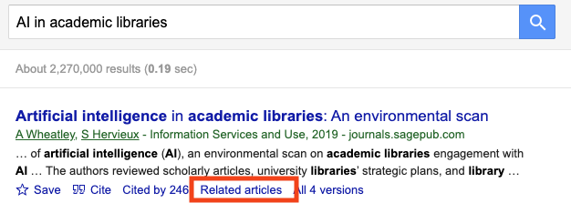

# AI for Search, Discovery, and Recommendation

## How AI Enhances Information Retrieval

### Why Information Retrieval Matters?
Information Retrieval (IR) focuses on helping people find useful information within large collections. As the amount of digital content grows, it becomes impractical to manually browse documents one by one. IR systems address this problem by organizing, searching, and prioritizing information so that users can quickly identify materials that are likely to meet their needs.

IR is embedded in many systems that people use daily. Examples include web search engines, library catalogs and discovery systems, academic databases, streaming platforms, and internal search tools in organizations. 

### How Information Retrieval Works
- **Indexing** is the process of preparing documents so they can be searched efficiently. Instead of scanning every document at query time, the system creates structured representations such as lists of terms, metadata fields, or other features that summarize what each document contains.

- **Querying** refers to how users express their information needs to the system, typically through keywords, phrases, or questions. The system interprets the query and matches it against the index to identify potentially relevant items.

### AI for Understanding Content

- **OCR + text understanding**: OCR (Optical Character Recognition) is a form of image recognition that detects and recognizes text in visual files such as scanned documents, photographs of pages, and image-based PDFs. By identifying text regions and converting visual characters into machine-readable text, OCR makes the contents of non–digital-born materials searchable and accessible to information systems.

    Basic text understanding then operates on the extracted text to identify document structure and basic elements, such as paragraphs, headings, dates, or layout boundaries. Rather than interpreting full meaning or assigning topics, this step prepares the text for downstream tasks like indexing, metadata enrichment, and search

    A practical example of OCR and basic text understanding is [Adobe PDF Extract API](https://developer.adobe.com/document-services/docs/overview/pdf-extract-api/), which converts scanned documents and other image-based PDF files into structured, machine-readable text.

- **AI for Indexing**: AI-based indexing works by having computers read large numbers of documents and look for patterns in the text, such as frequently discussed ideas, important terms, and how words are used together. From this, the system can automatically create summaries, topics, or labels that describe what each document is about.

    Unlike traditional indexing that depends on exact keywords or fixed rules, AI learns from examples and improves as it processes more documents. This makes it especially useful for large and changing collections, where new topics and terminology appear over time.

    One common example of AI-based indexing is *topic modeling*. Topic modeling helps the system discover main themes across a collection of documents by grouping texts that discuss similar ideas. For instance, in a large set of news articles or research papers, topic modeling can automatically identify topics such as healthcare, education, or technology and use them as index terms to support browsing and discovery.

- **AI for Enriching Metadata**: AI-based metadata enrichment focuses on adding or enhancing descriptive information for individual items, such as subject terms, keywords, named entities, or short summaries, based on document content. Rather than determining how documents are indexed at the system level, metadata enrichment improves how each item is described in catalogs, archives, or discovery systems.

    This is valuable for large-scale digitization projects or legacy collections, where records may contain minimal or inconsistent metadata. By automatically analyzing text, images, or audiovisual materials, AI can help fill in missing fields, standardize descriptions, and make materials easier to find and understand.

    A common example of AI-based metadata enrichment is *named entity recognition*. For instance, when processing a digitized historical letter or newspaper article, an AI system can identify people, organizations, and places mentioned in the text. These enriched metadata fields improve search, filtering, and user exploration without requiring manual cataloging of every item.

### AI for Understanding Queries
- **Natural language queries**: Traditional search systems often required users to translate their information needs into short keyword lists. AI-enhanced search systems allow users to enter full questions or descriptive phrases in natural language. AI-enhanced search tries to interpret what the user means in the whole query, not only match individual keywords. This can make searching easier for those who are not familiar with controlled vocabularies, database syntax, or advanced search operators, though advanced operators can still be useful for high-precision searching.

:::{.callout-tip title="Hands-on: Google Scholar vs. Scholar Labs (AI Search)"}

**Goal**: Experience the difference between traditional academic search and AI-enhanced search.

**Steps**

1. Choose a research question (write it as a full sentence). For example, "How is generative AI used in academic libraries, and what concerns does it raise?"  
2. Search the question in [**Google Scholar**](https://scholar.google.com/).   
3. Search the same question in [**Google Scholar Labs (AI Search)**](https://scholar.google.com/scholar_labs/search)  
4. Compare what you see.

**Notice**

- List of papers vs. summarized or structured answers  
- How much interpretation you must do yourself  
- How clearly sources are shown
- This activity is for exploration only. No submission required.

:::

- **Intent detection** describes a search system’s attempt to understand what a user wants to do with a query, not just which keywords were entered. This estimation helps the system decide how to organize and prioritize results, but it does not guarantee that the system always interprets the user’s intent correctly.

:::{.callout-tip title="Hands-on: Traditional Google Search vs. Google AI Mode"}

**Query:**  
> *U.S. climate change policy*

- [**Traditional Google Search**](https://www.google.com): mostly a list of links to explore  
- [**Google AI Mode**](https://google.com/aimode): a short overview appears at the top, with links as support

**Quick question:**  
Which version helps you understand the topic faster, and why?

:::

### AI for Interaction

- **Conversational search** allows users to interact with a search system in a question-and-answer style, similar to having a dialogue with a person. Instead of returning only a ranked list of documents, the system often provides a direct response or overview written in natural language. This changes the role of search from “finding documents” to “getting an initial understanding,” especially for broad or unfamiliar topics. Links and sources may still be available, but they are no longer the only entry point to information.

:::{.callout-tip title="Hands-on (conversational search)"}

Try the query *“data privacy in social media”* in two ways:  
    
- Run it in traditional Google Search.  
- Ask the same question in Google AI Mode or another conversational search tool, such as ChatGPT, Microsoft Copilot, or Claude.  
→ Compare whether you receive links first or an explanatory overview first, and how that affects your understanding.

:::

- **Follow-up and refinement (multi-turn search)**: Users do not need to fully reformulate their query each time. The system uses short-term memory of the ongoing interaction to keep track of earlier questions, allowing users to refine, narrow, or redirect their search through brief follow-up prompts. This supports exploratory searching, where users often clarify what they want only after seeing initial results. The interaction becomes incremental rather than one-shot.

:::{.callout-tip title="Hands-on (Follow-up and Refinement)"}

Continue from the previous query *“data privacy in social media”* in an AI-based tool (e.g., Google AI Mode, ChatGPT, Microsoft Copilot, or Claude).

Then follow up with:
    
- *“Focus on privacy risks for individual users.”*
- *“What has changed in recent years?”*

→ Notice that the system responds appropriately without you restating the full original query, relying on context from the ongoing interaction.

:::

- **System-guided exploration (suggested follow-up questions)**: AI-enhanced systems may guide users by proactively suggesting follow-up questions based on the current context of a search or interaction. These system-generated prompts help users explore a topic step by step, especially when they are unsure what to ask next. Rather than relying entirely on the user to plan the exploration path, the system provides possible next directions, influencing what information the user encounters and how the inquiry unfolds.

:::{.callout-tip title="Hands-on (System-guided Exploration)"}

Continue from the same interaction about *“data privacy in social media”* in an AI-based tool (e.g., Google AI Mode, ChatGPT, Microsoft Copilot, or Claude).

Instead of typing your own follow-up, look for a **system-suggested question**, such as:

- *“Would you like to know how to opt out of AI training on specific platforms?”*
- *“How do social media platforms collect and use personal data?”*

Choose one suggested question and continue the interaction.

→ Notice that the direction of the search is now proposed by the system, not initiated by you.

:::

## Vocabulary bridging across domains

Vocabulary bridging across domains refers to how AI-enhanced information systems help connect different terms that are used to describe the same or closely related concepts in different fields or communities. Users often search using everyday language or terminology from their own background, while relevant information may be indexed using specialized, technical, or discipline-specific terms.

Instead of requiring users to know the “correct” or preferred vocabulary in advance, these systems attempt to bridge that gap. They may map common expressions to professional terminology, connect synonyms across disciplines, or align user queries with established subject terms used in indexing and classification. As a result, users can retrieve relevant materials even when their original wording does not match the language used by experts or catalogers.

This capability is especially important in interdisciplinary research and professional information work, where the same concept may be described differently across medicine, law, social science, and everyday discourse. Vocabulary bridging lowers barriers to access, supports discovery across domains, and reduces reliance on prior knowledge of controlled vocabularies while still benefiting from them behind the scenes.

:::{.callout-tip title="Hands-on: Vocabulary Bridging in PubMed"}

**Goal:** Observe how an information system bridges everyday language and professional terminology.

**Steps:**
1. Go to https://pubmed.ncbi.nlm.nih.gov  
2. Search for: **heart attack**

**Notice:**
- PubMed maps the everyday term *“heart attack”* to the medical subject heading  
  **Myocardial Infarction [MeSH]**
- Many retrieved articles use *“myocardial infarction”* in their titles or abstracts, even though you did not search for that term.

**Key takeaway:**
You searched using everyday language, but the system retrieved results indexed with a professional medical term.

:::

 This [documentation](https://knowledge.exlibrisgroup.com/Primo/Product_Documentation/020Primo_VE/Primo_VE_(English)/040Search_Configurations/Configuring_Search_Expansion_with_Controlled_Vocabulary_for_Primo_VE) explains how Primo uses controlled vocabularies to expand user queries and map everyday language to standardized subject terms. 

## Pattern-based recommendation

Pattern-based recommendation refers to systems that suggest related items based on observed similarities and recurring associations across many documents or users. Instead of matching a new query, the system looks at which items are often connected. For example, which papers are frequently read, cited, or viewed together.

These recommendations do not require users to ask for them explicitly. Rather, the system offers additional materials that may be useful given what the user is currently viewing. This can support discovery by helping users move beyond their original search terms and notice related work they might not have found on their own.

Pattern-based recommendation does not mean that the system understands content in a human sense. It reflects patterns learned from existing data and past use, which shape what is suggested and what remains unseen.

:::{.callout-tip title="Hands-on: Pattern-based Recommendation in Google Scholar"}

**Goal:** Observe how recommendation systems support discovery beyond direct search.

**Steps:**
1. Go to https://scholar.google.com  
2. Search for a topic of interest (e.g., **AI in academic libraries**).  
3. Open one article from the results list.  
4. Click **“Related articles.”**

<figure class="course-figure">
    
    <figcaption>
    <em>Related articles feature in Google Scholar</em>
    </figcaption>
</figure>

**Notice:**
- The recommended articles are not generated answers.
- They are not necessarily the most recent or highest-ranked search results.
- Many share similar themes, methods, or citation patterns with the original article, even if keywords differ.

**Key takeaway:**
The system recommends items based on patterns across documents and user behavior, helping users discover relevant materials they did not explicitly search for.

:::
