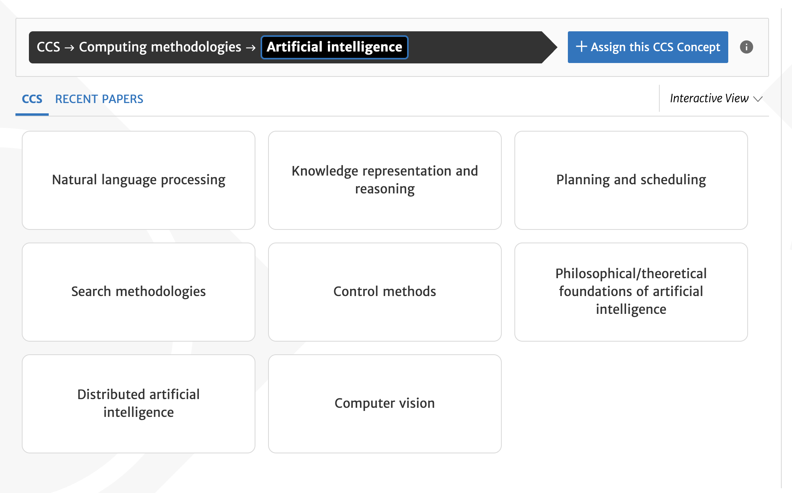
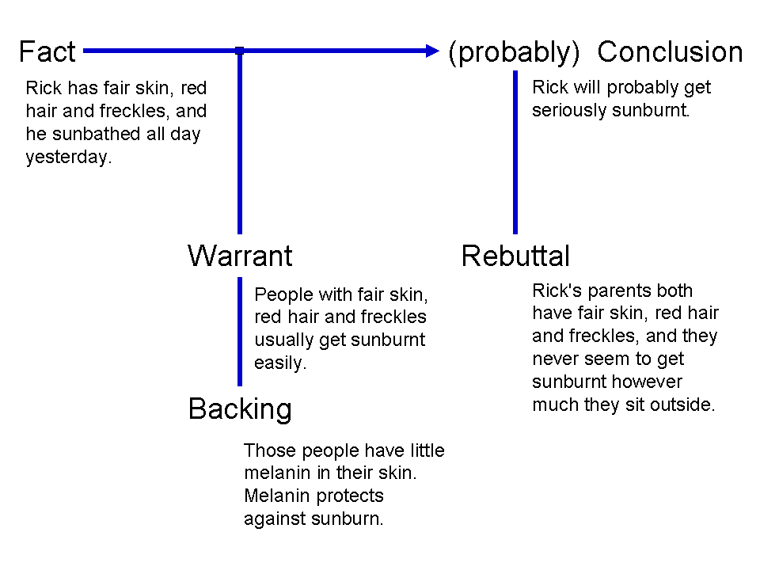

# Symbolic AI

Symbolic AI is about representing knowledge explicitly and using rules or logic so machines can reason about it. Symbolic AI matters for LIS because many information systems already rely on explicit knowledge organization, including metadata schemas, controlled vocabularies, authority control, and linked data.

Symbolic systems later became prominent in expert systems, where knowledge engineers encoded domain expertise as rules. These systems can work well in narrow domains where rules are stable and well defined.


## What is symbolic AI

Symbolic AI refers to approaches that represent knowledge using explicit symbols that stand for concepts, entities, or relations, and apply formal rules to manipulate those symbols in order to perform reasoning. This tradition is often associated with what is sometimes called “[Good Old-Fashioned AI](https://en.wikipedia.org/wiki/GOFAI)” (GOFAI), a label used to describe early AI research that emphasized logic, rule-based systems, and structured knowledge representations rather than statistical learning from large datasets.

Symbolic AI overlaps with LIS because both rely on explicit representation of concepts and relationships. Classification systems, subject headings, and metadata standards organize knowledge using defined categories and structured fields. From a symbolic AI perspective, these are not just tools for retrieval. They are formal representations of how a domain is understood and structured.

Symbolic AI is often contrasted with machine learning (subsymbolic AI).

1. Symbolic AI focuses on explicit representations.
   The system stores rules, facts, and relations in forms that humans can inspect.
2. Machine learning focuses on learned patterns from data.
   The system estimates parameters from examples and often does not store human readable rules.

**What symbolic AI is good at**

Symbolic approaches often work best when:

1. The domain concepts can be defined clearly.
2. The relevant exceptions can be stated and maintained.
3. The system needs traceable reasoning steps.
4. The system must align with explicit policy or professional rules.

These conditions appear in many institutional contexts, including compliance workflows, cataloging rules, and eligibility screening.

**Common limitations**

Symbolic systems have well known limitations:

1. **Brittleness**: Rules can fail when inputs vary in unexpected ways.

    *Example:*
    A rule states: If age < 18, then classify as minor.
    If the age field is missing, incorrectly formatted, or recorded as text rather than a number, the rule may not trigger correctly. The system fails not because the logic is wrong, but because the input does not match the expected structure.

2. **Knowledge acquisition bottleneck**: It can be slow and expensive to encode and maintain expert knowledge.

    *Example:*
    A clinical decision support system requires domain experts to encode detailed medication interaction rules. Each time medical guidelines are updated, experts must review and revise the rule base. The effort required to keep rules current can be substantial.

3. **Coverage gaps**: Rules usually cover what designers anticipated, not everything users will ask.

    *Example:*
    A rule-based intake form routes questions based on selected topics such as “tax filing,” “benefits,” and “housing assistance.” A patron submits a question about how changes in tax filing status may affect eligibility for housing benefits. Because the system treats each topic separately, and no rule accounts for cross-topic situations, the question may be routed incorrectly or assigned to a generic category.

4. **Difficulty handling ambiguity**: Natural language and everyday categories often have fuzzy boundaries.

    *Example:*
    A content classification rule states: If a book is about “health,” assign it to the Health category. A book on the social history of public health policy may be partly about health, partly about politics. The rule cannot easily capture the nuance without adding many exceptions.

These limitations help explain why many modern systems combine symbolic components with statistical methods.

Symbolic systems are strong when rules must be explicit, stable, and aligned with policy or expert knowledge. However, they struggle when inputs are noisy, ambiguous, or unpredictable. Statistical models, by contrast, can generalize from large amounts of data and handle variation more flexibly, but they may lack transparency and precise control.

By combining both approaches, designers can use statistical models to interpret messy input and symbolic rules to enforce constraints, apply policy boundaries, or ensure compliance.

:::{.callout-tip title="Hands on: When are symbolic systems appropriate?"}


**Goal:** Reflect on what kinds of domains are well suited for symbolic, rule-based systems.

Consider one real-world domain or service context that requires consistent decision making.
Examples may include tax filing eligibility, library circulation policy, clinical safety checks, building access control, or benefits qualification.

Think about the following:

**Part A: Structural features**

- What kinds of decisions must be made in this domain?
- Do these decisions rely on clear thresholds, stable categories, formal policy requirements, or legal constraints?
- Are the categories relatively stable over time, or do they shift frequently?

**Part B: Sample rules**

Imagine three simple "if-then" rules that could operate in this domain.

Example domain: Tax filing eligibility

Example rules:

- If annual income is below threshold X, then the individual qualifies for free filing assistance.
- If filing status is married filing jointly, then use schedule Y.
- If income includes self-employment revenue, then require additional documentation.

**Part C: Suitability**

As you reflect, consider:

- Why might this domain work well with symbolic rules?
- Where might rigid rules become limiting?
- Would some part of the workflow benefit from statistical or probabilistic components?

The purpose of this exercise is to recognize structural features that make a domain more or less appropriate for symbolic reasoning.

:::

**Further information:**

- [Knowledge Acquisition](https://www.sciencedirect.com/topics/computer-science/knowledge-acquisition)

## Logic programming

Logic programming is a paradigm in which programs are written as logical rules rather than step-by-step instructions.

Instead of telling the computer how to compute something procedurally, you describe:

- Facts about a domain  
- Rules that relate those facts  
- A goal or query  

The system then determines what follows logically from the rules. Logic programming is closely connected to symbolic AI. It treats reasoning as logical inference rather than statistical estimation.
Common examples of logic programming include [Prolog](https://en.wikipedia.org/wiki/Prolog) and [Answer Set Programming (ASP)](https://en.wikipedia.org/wiki/Answer_set_programming).

**Example structure**

A simple logic program might include:

```

bird(tweety).
penguin(tweety).

flies(X) :- bird(X), not penguin(X).

```

This reads as:

- Tweety is a bird.  
- Tweety is a penguin.  
- X flies if X is a bird and X is not a penguin.  

Logic programs use a compact rule format.

1. A line ending with a period is a fact.

```

bird(tweety).

```

This states that `bird` is true for `tweety`.

2. A rule has the form:

```

head :- body.

```

It means:

The head is true if the body is true.

3. In the example:

```

flies(X) :- bird(X), not penguin(X).

```

- `flies(X)` is the conclusion.
- `:-` can be read as “if”.
- The comma means logical AND.
- `not` means there is no evidence that the statement holds.
- `X` is a variable. Lowercase names like `tweety` are constants.

If the fact `penguin(tweety).` were removed, the system would derive that Tweety flies. The result depends entirely on the defined facts and rules.

The system evaluates which conclusions are logically consistent.

Unlike a machine learning model, the output depends entirely on the defined rules and facts.

:::{.callout-tip title="Hands on: Run a small logic program using Clingo"}


**Goal:** Observe how a logic programming system derives conclusions from rules.

Open the online Clingo environment: [https://potassco.org/clingo/run/](https://potassco.org/clingo/run/)

Choose one of the existing example programs provided on the page.

Here is a quick demo for how to run a logic program using Clingo:

<div style="position:relative;padding-bottom:56.25%;height:0;overflow:hidden;">
<iframe
    src="https://www.youtube-nocookie.com/embed/Bnz28FnzyXw"
    title="Clingo demo"
    style="position:absolute;top:0;left:0;width:100%;height:100%;border:0;"
    allow="accelerometer; autoplay; clipboard-write; encrypted-media; gyroscope; picture-in-picture; web-share"
    allowfullscreen>
</iframe>
</div>    

As you explore, consider:

- What are the basic facts in the program?
- What rules connect those facts?
- What conclusions does the system produce?
- Would the output change if you added or removed a rule?

Notice that the system is not predicting probabilities.
It is computing which statements logically follow from the rules.

If you have programming experience, reflect on how this differs from writing a program in Python or another procedural language.

- In Python, you specify control flow step by step.
- In logic programming, you specify constraints and relationships, and the solver finds a model that satisfies them.
- How does this change the way you think about problem solving?

You do not need to understand the full syntax.
Focus on how knowledge is represented and how conclusions are derived.


:::

## Rule-based reasoning and Expert Systems

An expert system is a type of symbolic AI system that represents knowledge explicitly and applies formal rules to support decision making.

An expert system stores knowledge in two forms:

1. Facts: Facts describe the current situation. They are pieces of information the system assumes to be true for a given case. Here are some examples:

    - Patron A has status "Faculty".
    - The item type is Reserve.
    - The loan request date is May 1.

2. Rules: Rules specify what action or conclusion should follow when certain facts are present. A rule usually has the structure: **If** certain conditions are true, **then** perform an action or derive a conclusion.
Here are some examples: 

    - **If** status is Faculty, **then** loan period is 28 days.
    - **If** item type is Reserve, **then** loan period is 2 hours.
    - **If** overdue days exceed 30, **then** suspend borrowing privileges.

In an expert system, these elements are stored in a knowledge base. The system then uses an inference engine to apply rules to facts and derive conclusions.

A simplified structure includes:

1. Knowledge base  
   Contains facts and rules that represent domain expertise.

2. Inference engine  
   Applies logical procedures to determine what conclusions follow from the stored rules and facts.

Rather than estimating probabilities, an expert system evaluates whether conditions are satisfied and then derives outcomes according to defined rules.

**Why Expert Systems mattered**

Expert systems became influential because they provided a way to formalize specialized knowledge and make it operational within information systems.

They offered several advantages:

1. Consistency  
   Similar inputs produce similar decisions when rules are applied uniformly.

2. Traceability  
   The system can often indicate which rules led to a particular conclusion.

3. Reproducibility  
   Decisions can be replicated across cases, locations, or staff members.

These characteristics are especially relevant in domains where decisions must be defensible and aligned with policy.

:::{.callout-tip title="Hands on: Experiencing a rule-based system in practice"}


**Goal:** Observe how a real-world public decision tool relies on explicit rules.

Visit the IRS Interactive Tax Assistant: [https://www.irs.gov/help/ita](https://www.irs.gov/help/ita)

Choose one of the available topics, such as filing status, dependency, or amended return.

As you go through the questions, pay attention to the structure of the interaction.

As you explore the tool, focus only on what you can directly observe.

- What types of information does the system ask for? Are the questions mostly about specific attributes such as income, filing status, age, or dependents?
- Do the questions appear structured rather than open-ended? For example, are you selecting from predefined options rather than typing free text?
- When you change an earlier answer, does the sequence of questions change?
- At the end of the interaction, how is the result presented? Is it framed as an eligibility determination, a recommendation, or an explanation?
- Based on your experience, does the system appear to rely on predefined categories and conditions?

Notice that the tool does not estimate probabilities.
It asks structured questions and applies predefined eligibility rules.

Reflect on:

- Why is a rule-based approach appropriate in this context?
- Where might rigid rules create edge cases?
- How does this compare to interacting with a generative AI chatbot about tax questions?

:::

## Knowledge representation

Symbolic systems depend on how knowledge is represented. Representation choices determine:

1. What the system can store.
2. What the system can infer.
3. What can be answered directly.

### Taxonomies

A taxonomy is a structured classification, often hierarchical.

1. It supports browsing.
2. It supports grouping and aggregation at broader levels. 
3. It supports more consistent labeling across records or collections.

Taxonomies are common in website navigation, subject browsing, and collection categories.

:::{.callout-tip title="Hands on: Exploring a formal taxonomy in practice"}


**Goal:** Observe how a professional classification system organizes knowledge hierarchically.

The Association for Computing Machinery (ACM) is a major international professional organization in computing and information science.  
It maintains the ACM Computing Classification System (CCS), a structured taxonomy used to categorize research publications.

Visit: [https://dl.acm.org/ccs](https://dl.acm.org/ccs)

Use the interface to browse categories related to Artificial Intelligence.

<div class="figure-row">
<figure class="course-figure">
    
    <figcaption>
    <em>A screenshot of CCS</em>
    </figcaption>
</figure>
</div>    

As you explore, notice:

- What is the top-level category under which Artificial Intelligence appears?
- How many layers of hierarchy are visible?
- Do categories become more specific as you move downward?
- How does the system label and structure subfields?
- Can one concept appear in multiple branches?

Pay attention to how the hierarchy supports navigation and conceptual organization.

:::

### Ontologies

An ontology is a structured way of defining concepts and the relationships between them.

Unlike a simple taxonomy, which mainly organizes categories into hierarchies, an ontology can describe multiple kinds of relationships and impose logical constraints.

Consider a simple example in a library context.

Classes:

- Person
- Author
- Book

Relations:

- A Book hasAuthor a Person.
- An Author is a type of Person.

Constraints:

- Every Book must have at least one Author.
- A Book cannot also be a Person.
- An Author must be a Person.

In this example:

- The taxonomy part defines that Author is a subclass of Person.
- The ontology adds richer structure by specifying how Books and Persons are related.
- The constraints prevent logically inconsistent combinations.

Ontologies allow systems to represent not only categories, but also structured relationships and rules about how entities can relate to one another.

They are especially useful when:

- Multiple systems must share consistent definitions.
- Data from different sources must be integrated.
- Logical consistency needs to be checked automatically.

Not every project requires a formal ontology.  
However, when semantic precision and interoperability matter, ontologies provide a more expressive framework than simple hierarchical classification.

:::{.callout-tip title="Hands on: Exploring an ontology with Schema.org"}


**Goal:** Observe how an ontology defines classes, properties, and constraints.

Visit the Schema.org [Getting Started page](https://schema.org/docs/gs.html)

Skim the page to understand what Schema.org is designed to do and how it structures data on the web.

Then explore specific classes, such as:

- [Person](https://schema.org/Person)
- [Place](https://schema.org/Place)

As you explore, focus on structure rather than technical details.

Notice:

- The formal definition provided for each class.
- The list of properties associated with the class.
- How properties reference other classes or value types.
- How the page indicates broader or more specific classes.

Consider:

- How is this different from a simple hierarchical category list?
- What kinds of constraints are implied by domain and range?
- What would happen if a website used a property for the wrong type of entity?
- How might defining properties in this way support consistency across different systems?

Focus on how the ontology defines what kinds of things exist and how they may relate.


:::

### Semantic Web

The idea of the Semantic Web is to make web data understandable not only to humans, but also to machines.

Traditional web pages are designed primarily for people to read. Relationships between people, organizations, and events are usually embedded in narrative text.

To make these relationships processable by systems, the Semantic Web uses structured representations. For example, instead of only writing a sentence such as “Tony Stark works at the University of Kentucky,” the same information can be expressed in a structured form.

In the Semantic Web, this structure is commonly represented using [Resource Description Framework (RDF)](https://en.wikipedia.org/wiki/Resource_Description_Framework), which organizes information as subject–predicate–object triples.

| Subject                     | Predicate  | Object                         |
|----------------------------|------------|--------------------------------|
| Tony_Stark                | rdf:type   | Person                         |
| University_of_Kentucky    | rdf:type   | Organization                   |
| Tony_Stark                | worksFor   | University_of_Kentucky         |

Each row follows the structure:

Subject → Predicate → Object

The predicate **rdf:type** is a standard Semantic Web property used to indicate class membership.

It can be read as:

- Tony_Stark is a Person.
- University_of_Kentucky is an Organization.

The third row expresses a relationship between two entities:

- Tony_Stark worksFor University_of_Kentucky.

In this format:

- The subject is the entity being described.
- The predicate names the type of relationship.
- The object is the related entity or class.

By making both relationships and class membership explicit, systems can process and connect data more reliably than when meaning is only implied in natural language.

In this representation, both category membership and relationships are made explicit.

Because the structure is standardized, different systems can interpret the same data in a consistent way.

This is one of the core goals of the Semantic Web: to describe entities and their relationships in a form that machines can interpret directly, rather than inferring meaning from unstructured text.

The Semantic Web emphasizes:

- Explicit identifiers for entities
- Clearly defined relationships
- Structured data that can be shared across systems

### Knowledge graphs

A knowledge graph is a large-scale, structured representation of entities and their relationships. Like a semantic network, it represents information as interconnected nodes and labeled relations.

A simple example might include:

- A work has an author.
- An author has an institutional affiliation.
- An institution is located in a place.

Instead of storing these as isolated records, a knowledge graph connects them into a network where each entity can be referenced consistently. Knowledge graphs extend this principle by linking entities through explicit relationships, not only by storing descriptive metadata. 

In large knowledge graphs, each entity is typically assigned a stable identifier. This allows different datasets to refer to the same person, organization, or concept consistently, even when names vary. For example, the same entity can be labeled differently across languages, but the identifier remains constant and links all language-specific names to the same underlying concept.


:::{.callout-tip title="Hands on: From structured statements to a visual knowledge graph"}


**Goal:** Experience how structured data can be queried and visualized as a knowledge graph.

Step 1: Explore an entity page.

Visit: [https://www.wikidata.org/](https://www.wikidata.org/)

Search for a well-known individual. Observe how information is presented as labeled statements rather than as narrative text.

Step 2: Run a structured query.

Visit: [https://query.wikidata.org/](https://query.wikidata.org/)

Copy and paste the following query into the editor:

```
SELECT ?person ?personLabel ?org ?orgLabel WHERE {
  ?person wdt:P31 wd:Q5.                 # human
  ?person wdt:P106 wd:Q82594.            # computer scientist
  ?person wdt:P101 wd:Q11660.            # field of work: AI
  ?person wdt:P108 ?org.                 # employer

  SERVICE wikibase:label { bd:serviceParam wikibase:language "en". }
}
LIMIT 80
```

Click “Run.”

This query retrieves up to 80 individuals who:

- are humans,
- are classified as computer scientists,
- work in the field of artificial intelligence,
- and have a recorded employer.

You do not need to understand the SPARQL syntax. Focus on what the query is asking and what results it produces.

After the results appear, switch the display mode to “Graph.”

If you need guidance, you may watch this short demonstration:

<div style="position:relative;padding-bottom:56.25%;height:0;overflow:hidden;">
  <iframe
    src="https://www.youtube-nocookie.com/embed/zzaG0dA6BwQ"
    title="Wikidata query demo"
    style="position:absolute;top:0;left:0;width:100%;height:100%;border:0;"
    allow="accelerometer; autoplay; clipboard-write; encrypted-media; gyroscope; picture-in-picture; web-share"
    allowfullscreen>
  </iframe>
</div>

In the graph view, observe:

- Each node represents a person or an organization.
- Each labeled line represents a relationship such as employment.
- Some organizations connect to multiple individuals.
- The structure forms a network rather than a simple list.

Reflect on:

- How does the graph view differ from the table view?
- What kinds of connections become visible in the network?
- How does this differ from reading biographical text in an encyclopedia?

The purpose of this activity is to see how structured statements can be retrieved and visualized as a knowledge graph.


:::

### Computational Argumentation

Computational argumentation studies how arguments can be represented, structured, and evaluated using formal or informal models. Instead of treating text as unstructured language, argumentation models represent:

- Claims
- Supporting arguments
- Opposing arguments
- Relations between arguments, such as one argument can support/attack another argument

This allows systems to analyze consistency, detect conflicts, and evaluate which claims are supported or attacked.

One influential framework for analyzing arguments is the Toulmin model, proposed by philosopher [Stephen Toulmin](https://en.wikipedia.org/wiki/Stephen_Toulmin).

<div class="figure-row">

  <figure class="course-figure">
    
    <figcaption><em>Toulmin's Argument Model</em></figcaption>

    <details class="image-source">
      <summary>Image source</summary>
      <div class="image-source-body">
        Image: Chiswick Chap, Wikimedia Commons (CC BY-SA 3.0)  
        https://commons.wikimedia.org/wiki/File:Toulmin_Argument_Model.png
      </div>
    </details>
  </figure>

</div>

The model breaks an argument into several components:

- Fact: The specific information or situation being considered.

- Conclusion: The statement that follows from the fact.

- Warrant: The reasoning that connects the fact to the conclusion.

- Backing: Additional support for the warrant.

- Qualifier: An indication of the strength of the conclusion, such as “probably” or “likely.”

- Rebuttal: Conditions or counterexamples that might weaken or defeat the conclusion.

:::{.callout-tip title="Hands on: Exploring structured argumentation with Kialo"}


**Goal:** Experience how arguments can be organized as structured relations rather than free text discussion.

Visit: [https://www.kialo.com/](https://www.kialo.com/)

Choose a public debate topic.

As you explore the discussion, notice:

- How each claim is displayed as a structured statement.
- How supporting and opposing arguments are visually separated.
- How arguments branch into more specific subclaims.
- How the structure resembles a tree or graph rather than a linear conversation.

You do not need to register or participate. Focus on observing how the platform organizes arguments.

Think about:

- What advantages does structured argument mapping provide?
- What kinds of reasoning become easier to follow?
- What kinds of nuance might be lost in a strictly structured format?

Think about how representing arguments as structured objects connects to symbolic AI and knowledge representation.

:::

:::{.callout-tip title="Hands on: Is Symbolic AI obsolete in the age of large language models?"}


**Goal:** Reflect on whether rule-based and symbolic approaches still matter today.

Symbolic AI has well-known limitations, including brittleness, limited coverage, and difficulty handling ambiguity.

At the same time, large language models have become widely used in many applications.

Consider the following questions:

- In what kinds of tasks might rule-based systems still be preferable to statistical or generative systems?
- Are there domains where explicit rules are required for legal, safety, or accountability reasons?
- Can you identify any current systems that rely on rules rather than learned models?
- When might a combination of symbolic and statistical methods be necessary?

You may briefly search for recent examples of rule-based systems in finance, healthcare, tax regulation, content moderation, or access control.

This is a preliminary reflection. In a later week, we will examine how symbolic and statistical approaches are combined in modern AI systems.


:::

**Further information**

- [Tutorial - HHAI: An Introduction to Computational Argumentation](https://ohaai.github.io/hhai.html)
- [Toulmin Argument](https://owl.purdue.edu/owl/general_writing/academic_writing/historical_perspectives_on_argumentation/toulmin_argument.html)
- [What Is a Knowledge Graph?](https://neo4j.com/blog/knowledge-graph/what-is-knowledge-graph/)
- [Knowledge Graphs in the Libraries and Digital Humanities Domain](https://doi.org/10.48550/arXiv.1803.03198)
- [From Knowledge Representation to Knowledge Organization and Back](https://doi.org/10.48550/arXiv.2312.07302)
- [Wikidata: The Making Of](https://doi.org/10.1145/3543873.3585579)
- [Symbolic artificial intelligence - Wikipedia](https://en.wikipedia.org/wiki/Symbolic_artificial_intelligence)
- [Expert system - Wikipedia](https://en.wikipedia.org/wiki/Expert_system)
- [Logic-Based Artificial Intelligence - Stanford Encyclopedia of Philosophy](https://plato.stanford.edu/entries/logic-ai/) (optional)